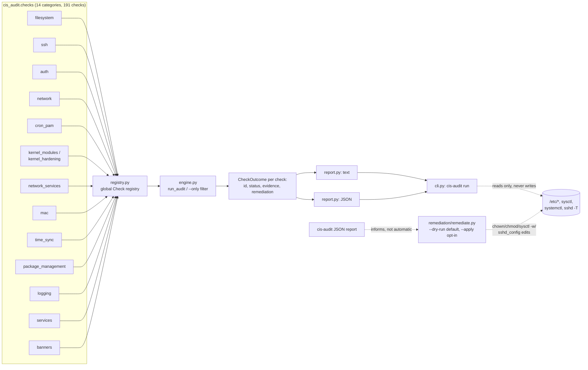

# linux-cis-hardening-auditor

[](https://github.com/John-Axe/linux-cis-hardening-auditor/actions/workflows/ci.yml)

Offline CLI that audits a Linux host against a real subset of the CIS
Ubuntu/Debian Linux Benchmark - 191 checks across 14 categories: filesystem
permissions and partition/mount hardening, SSH configuration, authentication/
password policy and PAM, cron/at access control, kernel module blacklisting
and kernel sysctl hardening, network hardening and unwanted network services,
mandatory access control (AppArmor/SELinux), time synchronization, package
management integrity, logging and auditing, and services. Stdlib-only
Python, no external calls, every check reports PASS/FAIL/NOT_APPLICABLE
backed by the actual system state it inspected (a real file mode, a real
sysctl value, a real `sshd -T` line) - never a canned string.

## Problem

Most "CIS hardening" scripts on GitHub either only *fix* things (so you can
never see what's currently wrong) or only produce a wall of text with no
machine-readable output for CI/reporting pipelines. This tool separates the
two cleanly: `cis-audit run` is 100% read-only and gives you a JSON report
you can diff over time or gate a pipeline on; the *optional*, separate
`remediation/remediate.py` is the only thing that ever touches the system,
and it's dry-run by default.

## Architecture



Each check is a plain function registered via `@register(id=..., title=...,
category=..., rationale=..., remediation=...)` in `cis_audit/registry.py`
(see [`src/cis_audit/checks/`](src/cis_audit/checks/)). `Check.execute()`
never lets a single check's exception crash the run - an unexpected error is
caught and reported as `NOT_APPLICABLE` with the exception text as evidence,
so one broken check can't take down the other 190. A handful of checks
(kernel module blacklisting, the expanded network sysctls, and several
duplicate-account/dotfile/legacy-entry checks in `auth_expanded.py`) are
generated by small factory functions rather than written out individually -
same pattern, just applied to a family of near-identical checks instead of
one-off code.

**Design choices that matter for correctness:**

- SSH checks prefer `sshd -T` (sshd's own dump of its *effective*
  configuration, including built-in defaults for anything not set
  explicitly) - the same source CIS itself recommends - and fall back to
  parsing `sshd_config` directly with OpenSSH's real first-occurrence-wins
  semantics when `sshd -T` can't run unprivileged.
- Sysctl checks read straight from `/proc/sys/*` (always readable, no
  subprocess needed) rather than shelling out to `sysctl` first.
- Anything that needs root to verify honestly (reading `/etc/shadow`,
  `/etc/sudoers`) reports `NOT_APPLICABLE` with a clear reason when it can't
  read the file, instead of guessing or silently reporting FAIL/PASS.
- No check ever prints a real password hash - see `utils.redact()` and
  `checks/auth.py`'s empty-password-field check, which reports usernames but
  never the hash field itself.

## Checks

| Category | Count | Examples |
|---|---|---|
| `filesystem` | 25 | `/etc/passwd`/`/etc/shadow`/`/etc/group`/`/etc/gshadow` permissions, world-writable/unowned file scans, home directory permissions, default umask, `/tmp`/`/var`/`/home`/`/dev/shm` partition separation and `nodev`/`nosuid`/`noexec` mount options, sticky bit on world-writable directories |
| `auth` | 23 | password max/min/warn age, empty shadow passwords, duplicate UID 0/UID/GID/username/group name, root's default group and PATH integrity, dangerous dotfiles (`.netrc`/`.forward`/`.rhosts`), home directory ownership, shadow group membership, legacy NIS `+` entries, password hash algorithm, default account inactivity lock |
| `cron_pam` | 21 | cron daemon active, `/etc/crontab`/`cron.{hourly,daily,weekly,monthly,d}` permissions, `at` access control, `su` restricted to a group, PAM `pwquality` (length/complexity/repeat/retry), `faillock` (deny/unlock_time/even_deny_root), password history (`pwhistory`) |
| `network` | 21 | IP forwarding, ICMP redirects (accept/send/secure, all+default scope), reverse-path filtering, SYN cookies, host firewall presence, source routing, martian packet logging, broadcast/bogus ICMP, IPv6 router advertisements and source routing |
| `network_services` | 20 | autofs/avahi/DHCP/DNS/Samba/FTP/IMAP-POP3/NFS/rpcbind/CUPS/rsync/SNMP/squid/Apache/nginx/xinetd not installed-or-active, X Window System absent, MTA local-only delivery, NIS client absent |
| `ssh` | 20 | root login, empty passwords, password auth, MaxAuthTries, X11 forwarding, warning banner, LoginGraceTime, MaxSessions, client-alive interval/count, TCP forwarding, user environment, rhosts, host-based auth, log verbosity, approved Ciphers/MACs/KexAlgorithms, compression, UsePAM |
| `kernel_modules` | 14 | blacklisting of cramfs/freevxfs/hfs/hfsplus/jffs2/squashfs/udf/usb-storage/dccp/sctp/rds/tipc/firewire-core/bluetooth |
| `kernel_hardening` | 10 | `kptr_restrict`, `dmesg_restrict`, `ptrace_scope`, hardlink/symlink/FIFO/regular-file protections, unprivileged BPF, BPF JIT hardening, `perf_event_paranoid` |
| `package_management` | 9 | APT GPG signature checking, HTTPS-only repositories, dpkg broken-package audit, AIDE installed and scheduled, bootloader config permissions/password, unattended-upgrades auto-reboot/remove-unused-dependencies |
| `banners` | 7 | `/etc/motd`/`/etc/issue`/`/etc/issue.net` permissions and OS-info leakage, GDM login banner |
| `mac` | 6 | AppArmor or SELinux installed, AppArmor enabled at boot and profiles loaded/enforcing, not both MAC systems installed, SELinux not disabled |
| `time_sync` | 6 | chrony/systemd-timesyncd installed and active, chrony/timesyncd has a configured time source, clock is currently synchronized, only one sync daemon active |
| `services` | 5 | legacy plaintext services absent, automatic security updates, ASLR, SUID core dumps restricted, no passwordless sudo |
| `logging` | 4 | auditd installed+enabled, a logging service is active, auth log permissions, cron restricted to authorized users |

Full list with rationale and remediation for each: run `cis-audit run
--format json | jq '.checks[] | {id, title}'`, or read the `@register(...)`
decorator at the top of each check in [`src/cis_audit/checks/`](src/cis_audit/checks/).

## Live run

Run against the real Ubuntu 26.04 WSL2 sandbox this project was built in
(`uname -a`: `Linux JOHNAXE-PC 6.18.33.1-microsoft-standard-WSL2`), as an
**unprivileged user**, on 2026-08-25, with `PATH` set to a standard system
value (`/usr/local/sbin:/usr/local/bin:/usr/sbin:/usr/bin:/sbin:/bin:...`)
for the published capture only, so `CIS-6.2.7`'s PATH-integrity evidence
doesn't echo this dev machine's personal tool directories - every other
check reads real, unmodified system state. This is a real dev sandbox, not
a hardened server - it fails plenty of checks, exactly as expected, and
nothing below has been edited to look better:

```
$ python -m cis_audit run --format text --output live_run_report.json
...
------------------------------------------------------------
Summary: 191 checks | 86 pass, 69 fail, 36 n/a
```

Full captured transcript: [`demo/live_run_session.txt`](demo/live_run_session.txt).
Full JSON report: [`demo/live_run_report.json`](demo/live_run_report.json)
(generic system state only - no real usernames or hostnames beyond standard
system accounts like `root`/`syslog`/`adm`, safe to publish as-is).

**Specific real findings, quoted directly from that run:**

- **`CIS-3.1.1` FAILED** - `net.ipv4.ip_forward = 1 (expected net.ipv4.ip_forward = 0)`.
  A WSL2 VM ships with forwarding on by default (needed for its own
  networking setup) - a real, correctly-detected deviation from the
  benchmark, not a tool bug.
- **`CIS-4.1` FAILED** - `No firewall tool found on PATH (checked ufw, nft, iptables) - no host-based firewall is installed.`
  None of `ufw`, `nft`, or `iptables` are installed on this box at all.
- **`CIS-6.1.3` PASSED** - `/etc/shadow: mode=640 owner=root group=shadow`,
  the actual octal mode this run read via `os.stat()`, not an assumption.
- **`CIS-6.2.1` (empty shadow passwords) reported `NOT_APPLICABLE`** -
  `/etc/shadow could not be read (requires root) - cannot verify password
  fields.` Running unprivileged, this check honestly can't see shadow's
  contents rather than guessing; running the same audit with `sudo` would
  flip this and the `CIS-5.3` (passwordless sudo) check to a real
  PASS/FAIL, since both depend on root-only files.
- **All 20 `ssh` checks reported `NOT_APPLICABLE`** - this sandbox has no
  `openssh-server` installed and no `/etc/ssh/sshd_config` at all, so SSH
  hardening genuinely doesn't apply here. On a box with sshd installed,
  these same checks flip to real PASS/FAIL against `sshd -T` output.
- **`CIS-1.1` (automatic security updates) PASSED** -
  `APT::Periodic::Unattended-Upgrade "1";` really is set in
  `/etc/apt/apt.conf.d/20auto-upgrades` on this box.
- **`CIS-1.1.1.1` (kernel module blacklisting) FAILED** for `cramfs` and
  13 other filesystem/network modules - `no install/blacklist directive
  for 'cramfs' found in /etc/modprobe.d/blacklist-ath_pci.conf, ...
  blacklist.conf, iwlwifi.conf - not blocked for future loads`. This WSL2
  kernel ships several hardware-driver blacklists by default, but none of
  the CIS-recommended filesystem/protocol modules - a genuinely new class
  of finding the original 35-check version couldn't see at all.
- **`CIS-5.1.3` (`/etc/cron.hourly` permissions) FAILED** -
  `/etc/cron.hourly: mode=755 owner=root group=root (expected mode <= 700,
  owner root)`. Debian/Ubuntu ships this directory at the default 755, not
  the CIS-recommended 700 - a real, previously-uncovered finding.
- **`CIS-1.5.2` (AppArmor enabled at boot) FAILED** -
  `/sys/module/apparmor/parameters/enabled = 'N'`. AppArmor is installed
  (`CIS-1.5.1` PASSED) but this WSL2 kernel wasn't booted with it enabled -
  exactly the "installed but not actually protecting anything" gap this
  check exists to catch.
- **`CIS-2.5.3` (chrony has an explicit time source) FAILED** -
  `chrony.conf time source directives: (none)` - while `CIS-2.5.5` (clock
  currently synchronized) still PASSED, since WSL2's `timedatectl` syncs
  the clock through the Windows host rather than chrony's own configured
  pool/server directives. Two checks, two different real answers about the
  same subsystem - not a contradiction, a genuine nuance the pair is
  designed to surface.

Re-run it yourself: `pip install -e . && cis-audit run`. With `sudo
cis-audit run`, the 2 checks that reported `NOT_APPLICABLE` here for
permission reasons (`CIS-6.2.1`, `CIS-5.3`) become fully verifiable.

## Usage

```bash
pip install -e .
cis-audit run                                    # text report to stdout
cis-audit run --format json                       # JSON report to stdout
cis-audit run --output report.json                 # also write JSON to a file
cis-audit run --only ssh                           # just one category
cis-audit run --fail-on-findings                   # exit 1 if anything FAILed (for CI gates)
```

`--only` accepts any of the 14 categories: `filesystem`, `auth`, `cron_pam`,
`network`, `network_services`, `ssh`, `kernel_modules`, `kernel_hardening`,
`package_management`, `banners`, `mac`, `time_sync`, `services`, `logging`.
Every run is read-only - `cis-audit` itself never modifies the system.

## Remediation

```bash
python3 remediation/remediate.py --list                       # see what's automatable
python3 remediation/remediate.py --check CIS-6.1.3             # dry run (default)
python3 remediation/remediate.py --check CIS-6.1.3 --apply     # actually fix it (needs root)
python3 remediation/remediate.py --all --apply                 # fix everything automatable
```

Dry-run by default, exactly like the safety convention in this portfolio's
[`it-helpdesk-sysadmin-portfolio`](https://github.com/John-Axe/it-helpdesk-sysadmin-portfolio)
scripts: nothing is touched unless `--apply` is passed explicitly, and
`--apply` without root exits with a clear `[SKIPPED] ... requires root`
message rather than silently doing nothing.

95 of the 191 checks have an automated fixer (file permissions, `login.defs`
password-policy values, select `sshd_config` directives, sysctl hardening
values including the expanded kernel-hardening and network sets, kernel
module blacklisting, cron/at access control, and PAM `pwquality`/`faillock`
values). `PasswordAuthentication` is deliberately **not** auto-fixed even
though `cis-audit` checks it (`CIS-5.2.10`) - flipping it to `no` before
confirming a working SSH key is set up can lock an operator out entirely, so
that one stays a manual, documented judgment call. Same standard applied to
the new checks: anything requiring a package install/purge
(`network_services`, `mac`, `time_sync` daemon choice), an `/etc/fstab`/
remount change (`filesystem_expanded`'s partition and mount-option checks),
a PAM-stack edit with real lockout risk (`su` restriction, password-history
`remember`), or human review (duplicate accounts, dangerous dotfiles, which
`NOPASSWD` sudoers line is actually intentional) is deliberately left
unautomated.

**Did not run `--apply` against this repo's own sandbox.** Every fixer that
touches a live setting requires root, and this sandbox's non-interactive
shell has no path to root (`sudo -n` fails with "interactive authentication
required" - verified, not assumed). `--apply` logic is instead covered by
`tests/test_remediate.py`, which redirects every fixer's file-path constants
to `tmp_path` and stubs out the `chown`/`chmod`/`sysctl`/`systemctl` calls,
so the actual file-editing and idempotency logic (e.g. "don't add the same
sysctl.d line twice") is verified without ever touching a real system file
in CI or locally.

## Development

```bash
pip install -e ".[dev]"
pytest -v                          # 335 unit tests, all check logic + remediation logic mocked
python -m cis_audit run            # live self-audit
```

Unit tests (`tests/`) mock `subprocess`/file reads for deterministic,
machine-independent coverage of every check's PASS/FAIL/NOT_APPLICABLE
branches. The [Live run](#live-run) section above is the only place real,
unmocked system state gets exercised and reported.

## Limitations, stated honestly

- Several checks (`/etc/shadow` contents, `/etc/sudoers` contents) require
  root to verify and report `NOT_APPLICABLE` rather than a guess when run
  unprivileged - this is intentional, not a bug, and is exactly what this
  project's own live run demonstrates above.
- The world-writable/unowned-file filesystem scan is bounded to a fixed set
  of directories (`/tmp`, `/var/tmp`, `/home`, `/etc`) and a 20,000-entry
  cap, not a full-disk walk - by design, so a run stays fast and bounded on
  any host, but it will not find issues outside those directories.
- `CIS-6.2.7` (root PATH integrity) is genuinely best-effort: it inspects
  *this process's own* `PATH`, which only really represents root's PATH
  when the audit itself is run as root - the evidence text says so
  explicitly rather than overclaiming.
- The text report (`report.py`) groups consecutive checks under one `==
  category ==` header rather than a global group-by, so a category whose
  checks come from two modules registered apart in `checks/__init__.py`
  (e.g. `network` from both `network.py` and `network_sysctl_expanded.py`)
  can print two separate headers in one run - cosmetic, not a scoring bug
  (every check still counts once, under its one real category).
- This is a meaningful *subset* of the full CIS benchmark (which runs to
  several hundred controls in total), not full benchmark coverage - though
  at 191 checks across 14 categories it now covers considerably more ground
  than the original 35, including partition/mount hardening, PAM
  `pwquality`/`faillock` internals, kernel module blacklisting, AIDE,
  mandatory access control, and time synchronization.

## License

MIT - see [LICENSE](LICENSE).
