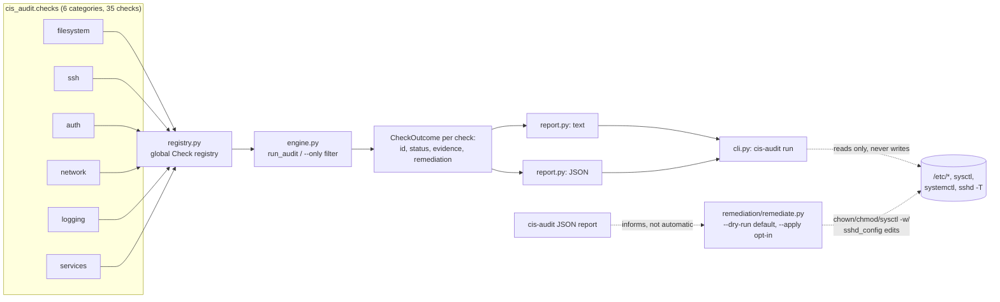

# linux-cis-hardening-auditor

[](https://github.com/John-Axe/linux-cis-hardening-auditor/actions/workflows/ci.yml)

Offline CLI that audits a Linux host against a real subset of the CIS
Ubuntu/Debian Linux Benchmark - 35 checks across filesystem permissions, SSH
configuration, authentication/password policy, network hardening, logging
and auditing, and services. Stdlib-only Python, no external calls, every
check reports PASS/FAIL/NOT_APPLICABLE backed by the actual system state it
inspected (a real file mode, a real sysctl value, a real `sshd -T` line) -
never a canned string.

## Problem

Most "CIS hardening" scripts on GitHub either only *fix* things (so you can
never see what's currently wrong) or only produce a wall of text with no
machine-readable output for CI/reporting pipelines. This tool separates the
two cleanly: `cis-audit run` is 100% read-only and gives you a JSON report
you can diff over time or gate a pipeline on; the *optional*, separate
`remediation/remediate.py` is the only thing that ever touches the system,
and it's dry-run by default.

## Architecture



Each check is a plain function registered via `@register(id=..., title=...,
category=..., rationale=..., remediation=...)` in `cis_audit/registry.py`
(see [`src/cis_audit/checks/`](src/cis_audit/checks/)). `Check.execute()`
never lets a single check's exception crash the run - an unexpected error is
caught and reported as `NOT_APPLICABLE` with the exception text as evidence,
so one broken check can't take down the other 34.

**Design choices that matter for correctness:**

- SSH checks prefer `sshd -T` (sshd's own dump of its *effective*
  configuration, including built-in defaults for anything not set
  explicitly) - the same source CIS itself recommends - and fall back to
  parsing `sshd_config` directly with OpenSSH's real first-occurrence-wins
  semantics when `sshd -T` can't run unprivileged.
- Sysctl checks read straight from `/proc/sys/*` (always readable, no
  subprocess needed) rather than shelling out to `sysctl` first.
- Anything that needs root to verify honestly (reading `/etc/shadow`,
  `/etc/sudoers`) reports `NOT_APPLICABLE` with a clear reason when it can't
  read the file, instead of guessing or silently reporting FAIL/PASS.
- No check ever prints a real password hash - see `utils.redact()` and
  `checks/auth.py`'s empty-password-field check, which reports usernames but
  never the hash field itself.

## Checks

| Category | Count | Examples |
|---|---|---|
| `filesystem` | 8 | `/etc/passwd`/`/etc/shadow`/`/etc/group`/`/etc/gshadow` permissions, world-writable file scan, unowned file scan, home directory permissions, default umask |
| `ssh` | 6 | root login, empty passwords, password auth, MaxAuthTries, X11 forwarding, warning banner |
| `auth` | 6 | password max/min age, warning age, empty shadow passwords, duplicate UID 0, root's default group |
| `network` | 6 | IP forwarding, ICMP redirects (accept/send), reverse-path filtering, SYN cookies, host firewall presence |
| `logging` | 4 | auditd installed+enabled, a logging service is active, auth log permissions, cron restricted to authorized users |
| `services` | 5 | legacy plaintext services absent, automatic security updates, ASLR, SUID core dumps restricted, no passwordless sudo |

Full list with rationale and remediation for each: run `cis-audit run
--format json | jq '.checks[] | {id, title}'`, or read the `@register(...)`
decorator at the top of each check in [`src/cis_audit/checks/`](src/cis_audit/checks/).

## Live run

Run against the real Ubuntu 26.04 WSL2 sandbox this project was built in
(`uname -a`: `Linux JOHNAXE-PC 6.18.33.1-microsoft-standard-WSL2`), as an
**unprivileged user**, on 2026-08-24. This is a real dev sandbox, not a
hardened server - it fails plenty of checks, exactly as expected, and
nothing below has been edited to look better:

```
$ python -m cis_audit run --format text --output live_run_report.json
...
------------------------------------------------------------
Summary: 35 checks | 18 pass, 9 fail, 8 n/a
```

Full captured transcript: [`demo/live_run_session.txt`](demo/live_run_session.txt).
Full JSON report: [`demo/live_run_report.json`](demo/live_run_report.json)
(generic system state only - no real usernames or hostnames beyond standard
system accounts like `root`/`syslog`/`adm`, safe to publish as-is).

**Specific real findings, quoted directly from that run:**

- **`CIS-3.1.1` FAILED** - `net.ipv4.ip_forward = 1 (expected net.ipv4.ip_forward = 0)`.
  A WSL2 VM ships with forwarding on by default (needed for its own
  networking setup) - a real, correctly-detected deviation from the
  benchmark, not a tool bug.
- **`CIS-4.1` FAILED** - `No firewall tool found on PATH (checked ufw, nft, iptables) - no host-based firewall is installed.`
  None of `ufw`, `nft`, or `iptables` are installed on this box at all.
- **`CIS-6.1.3` PASSED** - `/etc/shadow: mode=640 owner=root group=shadow`,
  the actual octal mode this run read via `os.stat()`, not an assumption.
- **`CIS-6.2.1` (empty shadow passwords) reported `NOT_APPLICABLE`** -
  `/etc/shadow could not be read (requires root) - cannot verify password
  fields.` Running unprivileged, this check honestly can't see shadow's
  contents rather than guessing; running the same audit with `sudo` would
  flip this and the `CIS-5.3` (passwordless sudo) check to a real
  PASS/FAIL, since both depend on root-only files.
- **All 6 `ssh` checks reported `NOT_APPLICABLE`** - this sandbox has no
  `openssh-server` installed and no `/etc/ssh/sshd_config` at all, so SSH
  hardening genuinely doesn't apply here. On a box with sshd installed,
  these same checks flip to real PASS/FAIL against `sshd -T` output.
- **`CIS-1.1` (automatic security updates) PASSED** -
  `APT::Periodic::Unattended-Upgrade "1";` really is set in
  `/etc/apt/apt.conf.d/20auto-upgrades` on this box.

Re-run it yourself: `pip install -e . && cis-audit run`. With `sudo
cis-audit run`, the 2 checks that reported `NOT_APPLICABLE` here for
permission reasons (`CIS-6.2.1`, `CIS-5.3`) become fully verifiable.

## Usage

```bash
pip install -e .
cis-audit run                                    # text report to stdout
cis-audit run --format json                       # JSON report to stdout
cis-audit run --output report.json                 # also write JSON to a file
cis-audit run --only ssh                           # just one category
cis-audit run --fail-on-findings                   # exit 1 if anything FAILed (for CI gates)
```

`--only` accepts any of: `filesystem`, `ssh`, `auth`, `network`, `logging`,
`services`. Every run is read-only - `cis-audit` itself never modifies the
system.

## Remediation

```bash
python3 remediation/remediate.py --list                       # see what's automatable
python3 remediation/remediate.py --check CIS-6.1.3             # dry run (default)
python3 remediation/remediate.py --check CIS-6.1.3 --apply     # actually fix it (needs root)
python3 remediation/remediate.py --all --apply                 # fix everything automatable
```

Dry-run by default, exactly like the safety convention in this portfolio's
[`it-helpdesk-sysadmin-portfolio`](https://github.com/John-Axe/it-helpdesk-sysadmin-portfolio)
scripts: nothing is touched unless `--apply` is passed explicitly, and
`--apply` without root exits with a clear `[SKIPPED] ... requires root`
message rather than silently doing nothing.

20 of the 35 checks have an automated fixer (file permissions, `login.defs`
password-policy values, select `sshd_config` directives, sysctl hardening
values, cron access control). `PasswordAuthentication` is deliberately
**not** auto-fixed even though `cis-audit` checks it (`CIS-5.2.10`) -
flipping it to `no` before confirming a working SSH key is set up can lock
an operator out entirely, so that one stays a manual, documented judgment
call. Same for anything requiring human review: an unexpected UID-0 account,
or deciding which `NOPASSWD` sudoers line is actually intentional.

**Did not run `--apply` against this repo's own sandbox.** Every fixer that
touches a live setting requires root, and this sandbox's non-interactive
shell has no path to root (`sudo -n` fails with "interactive authentication
required" - verified, not assumed). `--apply` logic is instead covered by
`tests/test_remediate.py`, which redirects every fixer's file-path constants
to `tmp_path` and stubs out the `chown`/`chmod`/`sysctl`/`systemctl` calls,
so the actual file-editing and idempotency logic (e.g. "don't add the same
sysctl.d line twice") is verified without ever touching a real system file
in CI or locally.

## Development

```bash
pip install -e ".[dev]"
pytest -v                          # 108 unit tests, all check logic + remediation logic mocked
python -m cis_audit run            # live self-audit
```

Unit tests (`tests/`) mock `subprocess`/file reads for deterministic,
machine-independent coverage of every check's PASS/FAIL/NOT_APPLICABLE
branches. The [Live run](#live-run) section above is the only place real,
unmocked system state gets exercised and reported.

## Limitations, stated honestly

- Several checks (`/etc/shadow` contents, `/etc/sudoers` contents) require
  root to verify and report `NOT_APPLICABLE` rather than a guess when run
  unprivileged - this is intentional, not a bug, and is exactly what this
  project's own live run demonstrates above.
- The world-writable/unowned-file filesystem scan is bounded to a fixed set
  of directories (`/tmp`, `/var/tmp`, `/home`, `/etc`) and a 20,000-entry
  cap, not a full-disk walk - by design, so a run stays fast and bounded on
  any host, but it will not find issues outside those directories.
- This is a meaningful *subset* of the full CIS benchmark (which runs to
  hundreds of controls across partition layout, PAM/pwquality internals,
  kernel module blacklisting, AIDE, etc.), not full benchmark coverage.

## License

MIT - see [LICENSE](LICENSE).
